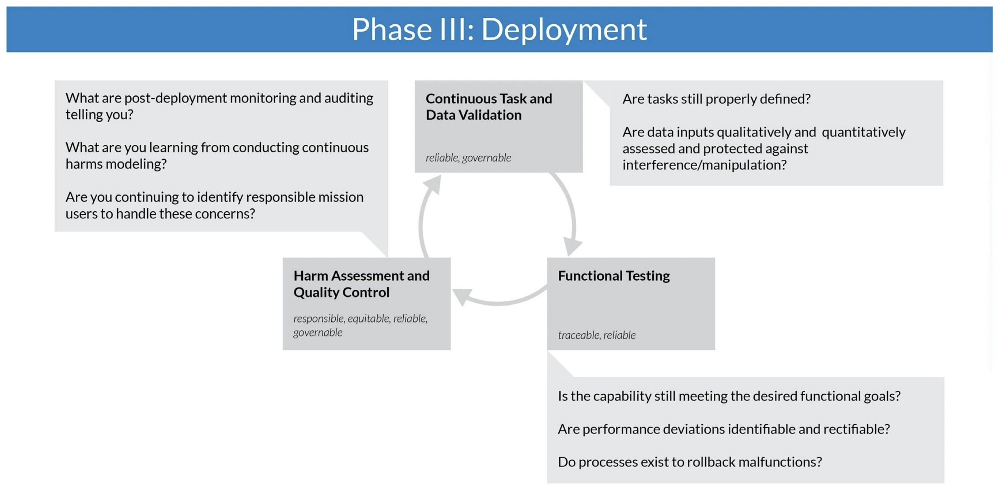

# Federal Responsible AI Template

This template is based on the Defense Innovation Unit's (DIU) Responsible AI Guidelines, which can be found [here](https://www.diu.mil/responsible-ai-guidelines).

# Project Name:

#### Project Goal: 
Describe the overall goal of this project

#### Evaluation Criteria:
What are the quantitative performance metrics that will be used to evaluate this project (KPI, accuracy, etc)?
What are the baselines that you will use to measure against for system performance?

# DIU Responsible AI Phases:

